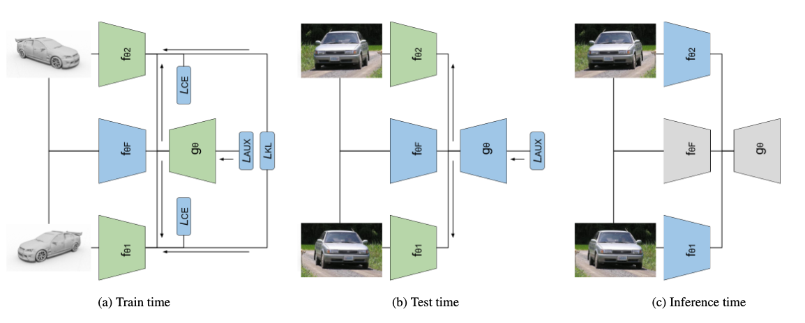

# ReC-TTT - Contrastive feature reconstruction for test-time training

Official implementation to reproduce experiments of ReC-TTT: contrastive feature reconstruction for test-time training. Currently submitted to WACV2025.
The code is greatly inspired by [ReContrast](https://github.com/guojiajeremy/ReContrast).

## Datasets
We conducted a series of experiments utilizing several image datasets. Specifically, we employed the CIFAR-10 dataset along with its corrupted versions, [CIFAR-10C](https://github.com/hendrycks/robustness) and [CIFAR-10.1](https://github.com/modestyachts/CIFAR-10.1). Additionally, we used the CIFAR-100 dataset and its corresponding corrupted variant, [CIFAR-100C](https://github.com/hendrycks/robustness). Finally, we evaluated our method on the [VISDA](https://ai.bu.edu/visda-2017/) dataset, performing adaptaion from training and validation sets as well as between the training and test sets.

## Training 
To perform the joint training of classification and auxiliary task run [train_recttt](train_recttt.py) for CIFAR datasets and [train_recttt_visda](train_recttt_visda.py) for VISDA dataset.

## Adaptation evaluation
To evaluate the adaptation performance run [test_recttt](test_recttt.py) for CIFAR datasets and [test_recttt_visda](test_recttt_visda.py) for VISDA dataset.
